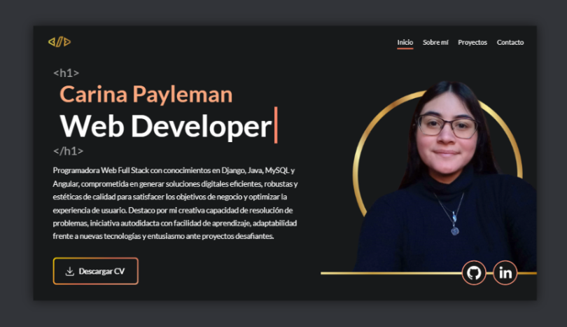

# Mi Portfolio 💖



¡Hola! Soy PaylemanC y este repositorio contiene el código de mi portafolio web 💖 Es una muestra de mis habilidades como Desarrolladora Full Stack: un poco sobre mí, mis proyectos favoritos, herramientas y frameworks que utilizo, habilidades blandas, etc. 

Este es un proyecto Open Source hecho en Angular. Siéntete libre de utilizarlo para tu propio portafolio modificándolo a tu gusto. Si lo haces, ¡me encantaría verlo! 😊

### Tecnologías usadas
* **Angular 15.2.6** - TypeScript, HTML5, CSS3
* AOS - Animate On Scroll Library
* Netlify - Deploy

## Instalación

1. Clona el repositorio en local con Git:

```bash {"id":"01HKRDPAKETVPNRRT9W0F3MG0Q"}
git clone https://github.com/PaylemanC/portfolio.git


```

2. Instala las dependencias con [npm](https://nodejs.org/es/download):

```bash {"id":"01HKRDPAKETVPNRRT9W2Y7QRDJ"}
npm install


```

* Inicia servidor con:

```bash {"id":"01HKRDPAKETVPNRRT9W50P4NXW"}
ng serve

```

Y abre el navegador por default en `http://localhost:4200/`

* Compila el proyecto para producción con:

```bash
ng build --configuration production
```

Para más comandos de desarrollo de Angular, visita la [documentación oficial](https://angular.io/cli#command-overview).


## Data & Estructura

```
src/
|-- app/
|   |-- components/
|   |-- interceptors/
|   |-- models/
|   |   |-- institute¹/
|   |   |-- project²/
|   |   |-- skill³/
|   |-- pages/
|   |   |-- home⁴/
|   |-- services/
|   |-- shared/
|-- assets/
|   |-- data/
|   |   |-- data.json⁵
|   |   |-- cv.pdf*
|   |-- styles/
```
1. **Institute**: Archivo molde para datos de formación académica.
2. **Project**: Archivo molde para datos de proyectos.
3. **Skill**: Archivo molde para datos de hard y soft skills.
4. **Home**: Componente principal de la página.
5. **data.json***: Toda la información.
6. **cv.pdf***: Currículum Vitae.
7. **styles**: Archivos de estilos de variables, mixins y animaciones.

*importante que sean esos nombres y no otros, los servicios están conectados a estos archivos para renderizar la información con ese formato y nombre de archivo.

## Contacto

Si tienes alguna duda o sugerencia, no dudes en contactarme a través de mi [LinkedIn](https://www.linkedin.com/in/carina-rocio-payleman/), y te invito a echarle un vistazo a otros proyectos míos aquí en [GitHub](https://github.com/PaylemanC?tab=repositories). ¡Gracias por ver! 💖
