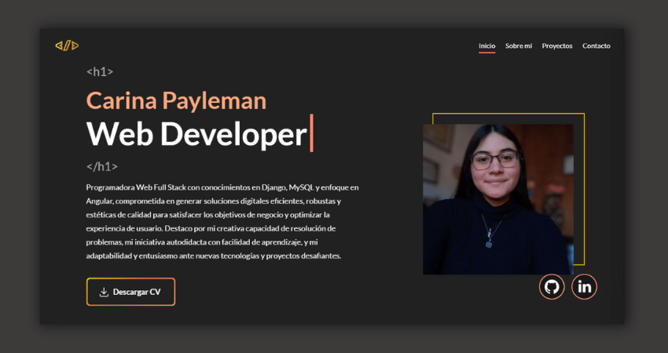

# Mi Portfolio 💖



¡Este repositorio contiene el código de mi portafolio! 💖 Es una muestra de mis habilidades como Desarrolladora Full Stack: un poco sobre mí, mis proyectos favoritos, herramientas y frameworks que utilizo, habilidades blandas, etc. Explora mi portafolio para tener una visión de mis capacidades y mi pasión por crear sitios web. Gracias por ver! 💘

Este es un proyecto en Angular 15.2.6, Open Source. Siéntete libre de utilizarlo para tu propio portafolio modificándolo a tu gusto. Si lo haces, ¡me encantaría verlo! 😊

## Instalación

Clona el repositorio:

```bash
git clone https://github.com/PaylemanC/myPortfolio.git
```

Instala las dependencias con [npm](https://nodejs.org/es/download):

```bash
npm install
```

Iniciar servidor con:

```bash
ng serve
```

Y abre el navegador en `http://localhost:4200/`

Para más comandos de desarrollo de Angular, visita la [documentación oficial](https://angular.io/cli#command-overview).

## Uso

Este proyecto es **Open Source**, por lo que puedes clonarlo y editarlo a gusto. Puedes añadir tus datos yendo a `src/app/app.component.ts`. Allí encontrarás objetos para modificar a tu gusto.

<!-- ## Development server

Run `ng serve` for a dev server. Navigate to `http://localhost:4200/`. The application will automatically reload if you change any of the source files.

## Code scaffolding

Run `ng generate component component-name` to generate a new component. You can also use `ng generate directive|pipe|service|class|guard|interface|enum|module`.

## Build

Run `ng build` to build the project. The build artifacts will be stored in the `dist/` directory.

## Running unit tests

Run `ng test` to execute the unit tests via [Karma](https://karma-runner.github.io).

## Running end-to-end tests

Run `ng e2e` to execute the end-to-end tests via a platform of your choice. To use this command, you need to first add a package that implements end-to-end testing capabilities.

## Further help

To get more help on the Angular CLI use `ng help` or go check out the [Angular CLI Overview and Command Reference](https://angular.io/cli) page. -->
